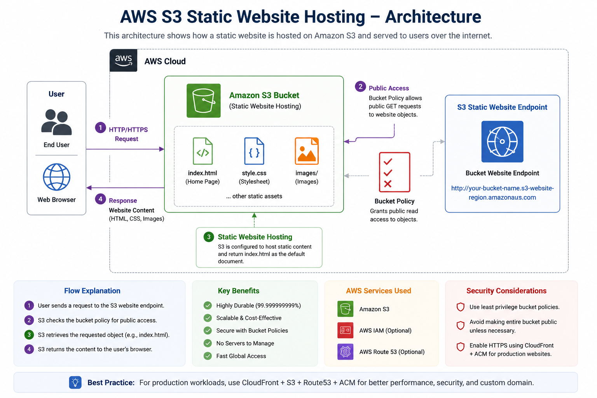
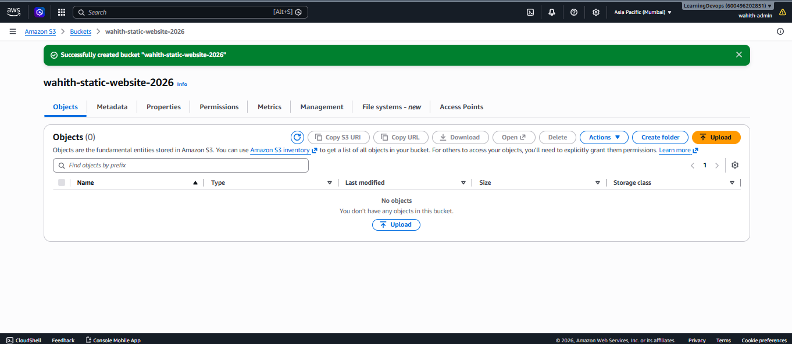
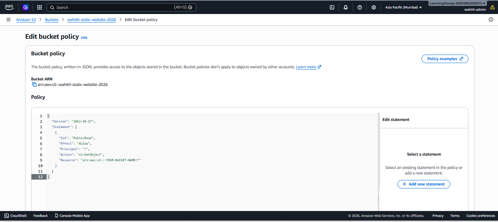
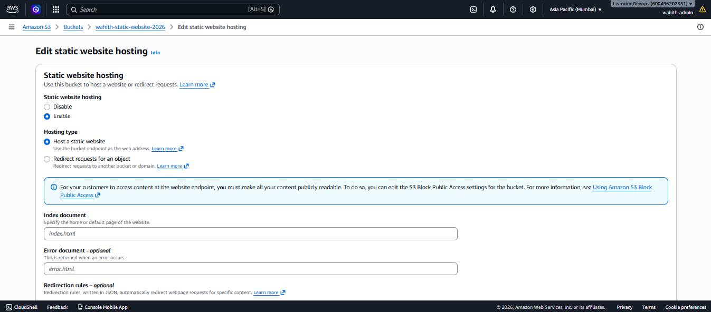
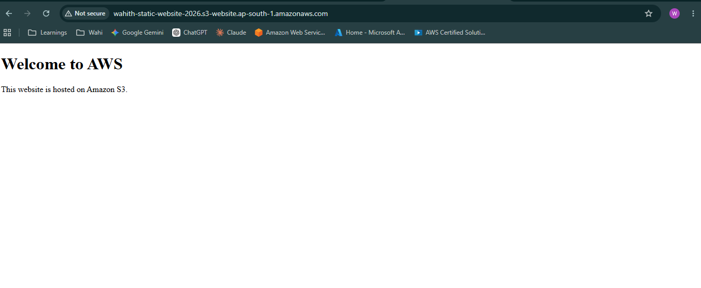

# 🚀 AWS S3 Static Website Hosting

A hands-on AWS project demonstrating how to host a static website using **Amazon S3 Static Website Hosting**.

---

# 📖 Project Overview

This project showcases how to deploy a static website using Amazon S3 by configuring:

- Amazon S3 Bucket
- Static Website Hosting
- Bucket Policy
- Public Access Configuration

The website is publicly accessible through the S3 Website Endpoint.

---

# 🏗️ Architecture



---

# ☁️ AWS Services Used

| Service | Purpose |
|----------|---------|
| Amazon S3 | Object Storage & Static Website Hosting |
| IAM | Access Management |
| Bucket Policy | Public Read Access |

---

# 📂 Repository Structure

```text
aws-s3-static-website/
│
├── architecture/
│   └── Architecture.png
│
├── bucket-policy/
│   └── bucket-policy.json
│
├── screenshots/
│   ├── Bucket.png
│   ├── Bucketlist.png
│   ├── hosting.png
│   └── Website.png
│
├── website/
│   ├── index.html
│   └── style.css
│
└── README.md
```

---

# 🚀 Deployment Steps

### Step 1

Created an Amazon S3 Bucket.

---

### Step 2

Uploaded the website files.

- index.html
- style.css

---

### Step 3

Enabled Static Website Hosting.

Configured:

- Index Document
```
index.html
```

---

### Step 4

Disabled Block Public Access for the bucket.

---

### Step 5

Configured the Bucket Policy to allow public read access.

---

### Step 6

Accessed the website using the S3 Website Endpoint.

---

# 📸 Project Screenshots

## S3 Bucket



---

## Bucket Objects



---

## Static Website Hosting



---

## Website Output



---

# 🛠️ Challenges Faced

## Issue

Received **404 Not Found** while accessing the website.

### Root Cause

The `index.html` file was uploaded inside a folder instead of the bucket root.

### Resolution

Moved the website files to the root of the bucket.

The website loaded successfully afterward.

---

# 📚 Key Learnings

- Amazon S3
- Static Website Hosting
- Bucket Policies
- Public Access Configuration
- Website Endpoint
- Object Storage
- Troubleshooting S3 Errors

---

# 💰 Cost Considerations

This project uses AWS Free Tier eligible services.

Estimated monthly cost for a small static website:

- Amazon S3 Storage
- GET Requests
- Data Transfer

Typically only a few cents per month outside the Free Tier.

---

# 🔐 Security Best Practices

- Enable Block Public Access by default.
- Grant only the minimum required permissions.
- Use Bucket Policies instead of making the entire bucket publicly writable.
- Use CloudFront + ACM + Route 53 for production deployments.

---

# 🚀 Future Improvements

- CloudFront Distribution
- Route 53 Custom Domain
- HTTPS using ACM
- Versioning
- Access Logging
- Lifecycle Policies
- CI/CD Deployment

---

# 👨‍💻 Author

**Alwahith**

AWS Cloud Engineer Portfolio Project
